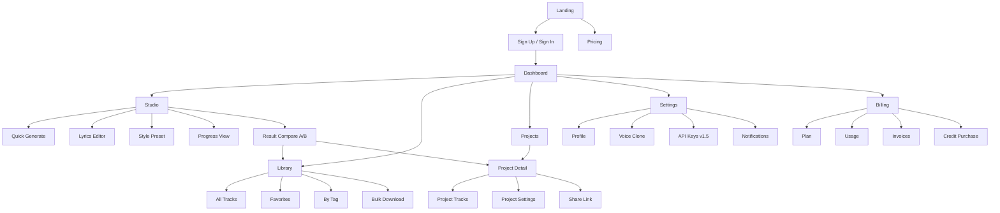
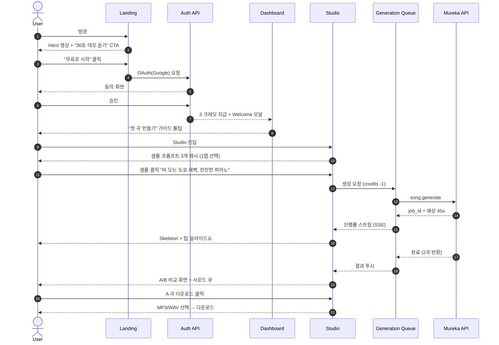
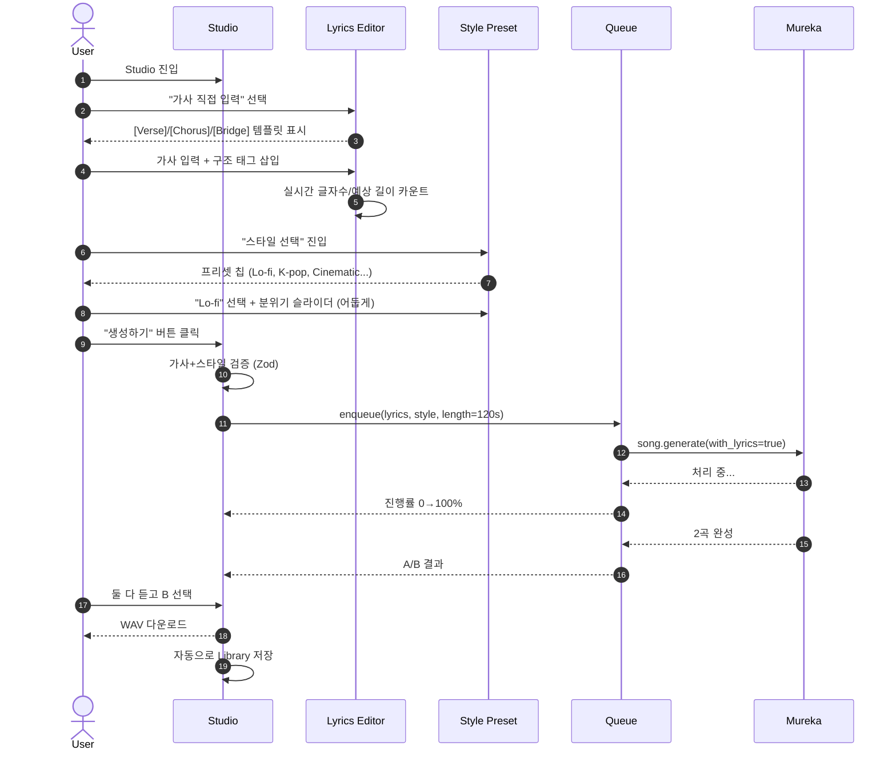
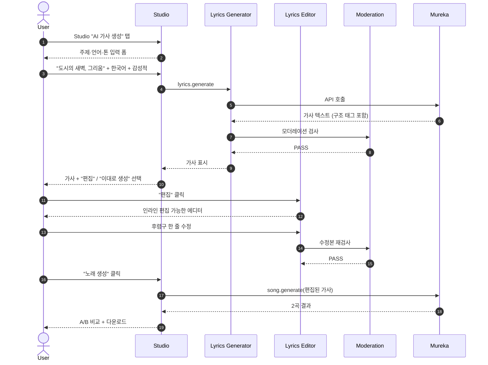
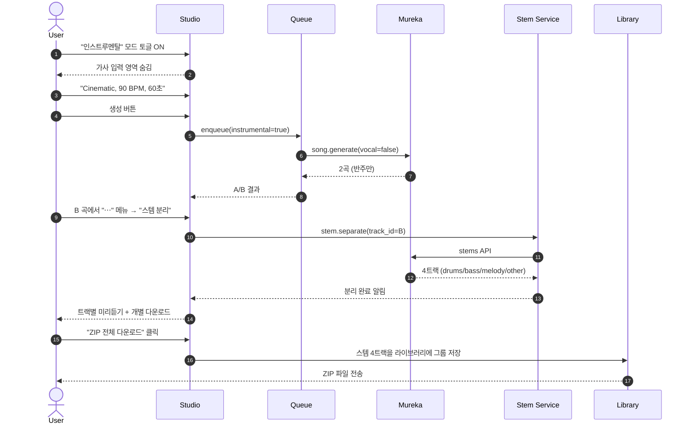
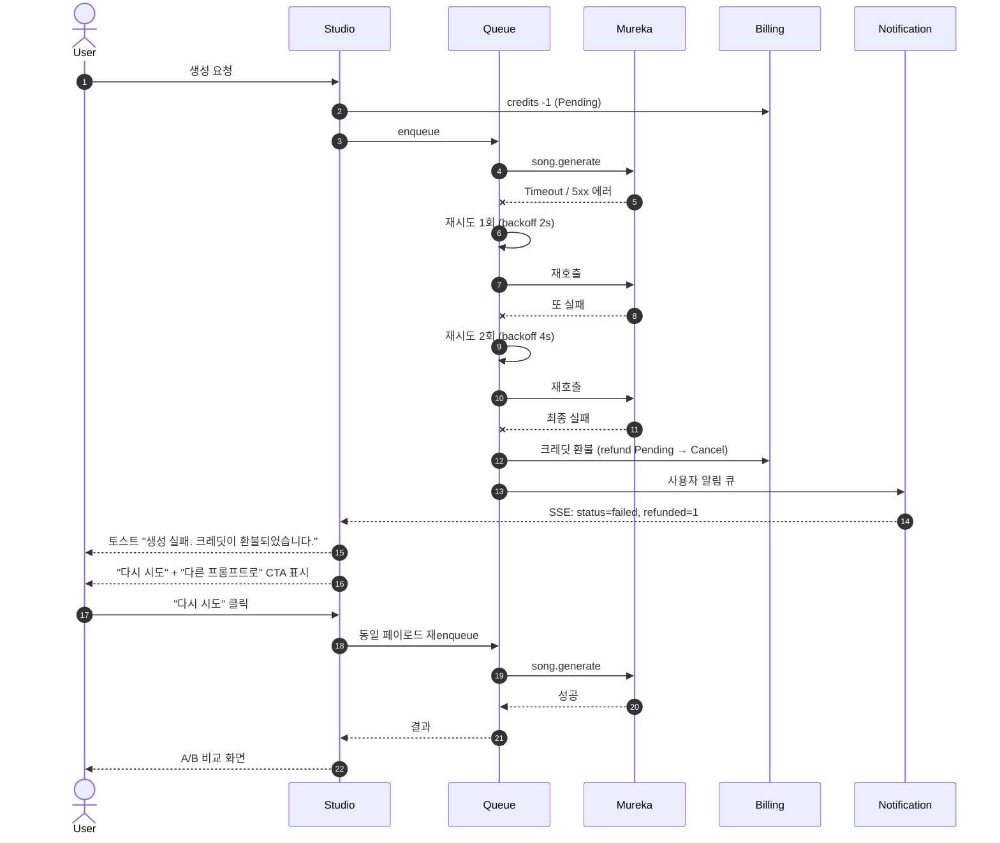

# 02-UX-Design: Music Maker — UI/UX 설계서

> 작성일: 2026-05-15
> 기반 문서: `docs/01-PRD.md`
> 상태: Draft v0.1
> 디자인 원칙: **Dark-first / Studio-grade / 45초 안에 끝나는 만족감**

---

## 0. 디자인 원칙 (UX Principles)

| # | 원칙 | 설명 |
|---|---|---|
| P1 | **Stay in the Studio** | 생성-듣기-수정의 사이클이 한 화면에서 끊김 없이 진행되어야 한다 |
| P2 | **Dark by Default** | 영상 편집·음악 작업은 야간/저조도에서 진행되므로 다크 모드를 기본값으로 설계 |
| P3 | **Progress Over Spinners** | 45초 대기 동안 단순 스피너 대신 진행률·팁·예상 시간을 노출 |
| P4 | **Compare, Don't Choose Blind** | Mureka가 1회 호출에 2곡을 반환하므로 항상 A/B 비교 UI로 의사결정 지원 |
| P5 | **Reversible Mistakes** | 실패·취소·재생성은 크레딧 환불과 명시적 피드백으로 안전감 부여 |

---

## 1. 정보 구조 (IA)

### 1.1 사이트맵



### 1.2 페이지 책임 매트릭스

| 페이지 | 1차 책임 | 2차 책임 | 진입 경로 | 인증 |
|---|---|---|---|---|
| Landing | 가치 제안 + CTA | 데모 음원 청취 | 외부 검색/광고 | × |
| Dashboard | 빠른 진입 허브 | 최근 트랙·잔여 크레딧 | 로그인 후 자동 | ◯ |
| Studio | 음원 생성 작업 | 가사 편집·프리셋 적용 | Dashboard `+` | ◯ |
| Library | 모든 트랙 관리 | 검색·태그·다운로드 | Side Nav | ◯ |
| Projects | 폴더별 그룹 관리 | ZIP 일괄 다운로드·공유 | Side Nav | ◯ |
| Settings | 계정/보컬 클로닝 | 알림 설정 | Topbar Avatar | ◯ |
| Billing | 결제·플랜·사용량 | 크레딧 추가 구매 | Topbar Avatar | ◯ |

### 1.3 글로벌 내비게이션 구조

```
┌─ Topbar ─────────────────────────────────────────────────────────┐
│  [♪ Music Maker]                  [Search]   [Credits: 42]  [👤] │
├─ Side Nav (desktop) ─┬──────────────────────────────────────────┤
│ 🏠 Dashboard          │                                          │
│ 🎙 Studio            │            <Page Content>                │
│ 📚 Library            │                                          │
│ 📁 Projects           │                                          │
│ ─────                 │                                          │
│ ⚙ Settings           │                                          │
│ 💳 Billing            │                                          │
└──────────────────────┴──────────────────────────────────────────┘
```

> **모바일**: Side Nav는 햄버거 → 하단 탭(Dashboard/Studio/Library/Profile) 4개로 전환

---

## 2. 핵심 사용자 플로우 (Mermaid sequenceDiagram)

### 2.1 Flow #1 — 신규 가입 → 첫 음원 생성



### 2.2 Flow #2 — 가사 직접 입력 → 스타일 선택 → 생성 → 다운로드



### 2.3 Flow #3 — AI 가사 자동 생성 → 편집 → 노래 생성



### 2.4 Flow #4 — 인스트루멘탈만 생성 → 스템 분리



### 2.5 Flow #5 — 생성 실패 시 재시도 & 크레딧 환불



---

## 3. 와이어프레임

### W1. 메인 Studio 화면 (3-pane Layout)

```
┌─────────────────────────────────────────────────────────────────────────────┐
│ ♪ Music Maker            [Search _________]      Credits: 42  [👤 유진 ▾] │
├──────────┬──────────────────────────────────────────┬──────────────────────┤
│          │                                          │  History (Today)     │
│ [+ New]  │  ┌─ Prompt ──────────────────────────┐   │ ┌──────────────────┐ │
│          │  │ 비 오는 도쿄 새벽, 잔잔한 피아노 │   │ │ ▶ 새벽 도쿄 #3  │ │
│ 🎙 Quick │  │                                  │   │ │   2분 전 • 60s   │ │
│ 📝 Lyric │  └──────────────────────────────────┘   │ └──────────────────┘ │
│ 🎚 Style │                                          │ ┌──────────────────┐ │
│ 🔁 Stems │  Mode: ◉ Song  ○ Instrumental           │ │ ▶ Lo-fi vibes #1│ │
│          │  Length: [────●────] 90s                 │ │   1시간 전       │ │
│          │  Style: [Lo-fi ✕] [Mellow ✕] [+ 추가]   │ └──────────────────┘ │
│          │                                          │                      │
│          │  ┌──────────────────────────────────┐   │ History (Earlier)    │
│          │  │       🎵  Now Playing             │   │ ┌──────────────────┐ │
│          │  │   ▶  ━━━━●━━━━━━━━━━━  0:42/1:30  │   │ │ ▶ 게임 BGM #02  │ │
│          │  │   〰️〰️〰️〰️〰️〰️〰️〰️〰️〰️〰️〰️    │   │ │   어제           │ │
│          │  └──────────────────────────────────┘   │ └──────────────────┘ │
│          │                                          │                      │
│          │     [ ✨  Generate ]    cost: 1 credit  │  [전체 보기 →]       │
└──────────┴──────────────────────────────────────────┴──────────────────────┘
   Left: 모드     Center: 입력+플레이어                  Right: 히스토리
```

**반응형**:
- ≥1280px: 3-pane (좌 220px / 중앙 flex / 우 320px)
- 768~1279px: 2-pane (좌측 모드는 상단 탭으로, 우측 히스토리는 슬라이드 패널)
- <768px: 1-pane 스택 (히스토리는 FAB로 접근)

### W2. 가사 에디터

```
┌─────────────────────────────────────────────────────────────────────┐
│  ← 뒤로       가사 에디터        [AI로 채우기 ✨]    [저장]         │
├─────────────────────────────────────────────────────────────────────┤
│  구조 추가:  [+ Verse] [+ Chorus] [+ Bridge] [+ Outro] [+ Hook]    │
├─────────────────────────────────────────────────────────────────────┤
│                                                                     │
│  [Verse 1] ─────────────────────────────────────────  ⋮             │
│  ┌───────────────────────────────────────────────────────────┐     │
│  │ 도시는 잠들지 않아                                       │     │
│  │ 새벽 세 시의 거리                                        │     │
│  │ 우리 둘만 남은 듯한                                      │     │
│  │ 이 고요 속을 걷네                                        │     │
│  └───────────────────────────────────────────────────────────┘     │
│  4 lines · 28 syllables · 예상 18초                                │
│                                                                     │
│  [Chorus] ──────────────────────────────────────────  ⋮             │
│  ┌───────────────────────────────────────────────────────────┐     │
│  │ Let it rain, let it rain                                  │     │
│  │ 비처럼 흘러 가도록                                       │     │
│  └───────────────────────────────────────────────────────────┘     │
│  2 lines · 18 syllables · 예상 12초                                │
│                                                                     │
│  [Verse 2] ─────────────────────────────────────────  ⋮             │
│  ┌───────────────────────────────────────────────────────────┐     │
│  │ (빈 칸 - 클릭하여 입력)                                  │     │
│  └───────────────────────────────────────────────────────────┘     │
│                                                                     │
├─────────────────────────────────────────────────────────────────────┤
│  총 6 lines · 약 30초                       [⚠ 모더레이션 PASS]   │
│                              [ ✨ 이 가사로 노래 생성 → ]            │
└─────────────────────────────────────────────────────────────────────┘
```

**상호작용**:
- 섹션 블록은 드래그 앤 드롭으로 순서 변경
- `⋮` 메뉴: 복제 / 삭제 / AI 보완 / 다른 운율로 변환
- 모더레이션 실패 시 빨간 라인 + 어떤 표현이 문제인지 호버 툴팁

### W3. 스타일 프리셋 선택

```
┌─────────────────────────────────────────────────────────────────────┐
│  ← 뒤로       스타일 선택                              [선택 완료]  │
├─────────────────────────────────────────────────────────────────────┤
│                                                                     │
│  장르 (Genre Chips · 다중 선택)                                    │
│  ┌────────────────────────────────────────────────────────────┐    │
│  │ [Lo-fi ✓] [K-pop]  [EDM]   [Cinematic]  [Jazz]            │    │
│  │ [Rock]    [Folk]   [R&B ✓] [Hip-hop]    [Ambient]         │    │
│  │ [Chiptune][Trap]   [Funk]  [+ Custom]                     │    │
│  └────────────────────────────────────────────────────────────┘    │
│                                                                     │
│  분위기 슬라이더 (Mood Sliders)                                    │
│                                                                     │
│  에너지     낮음 ●━━━━━━━━━━●━━━━ 높음    [60]                   │
│  밝기       어둡게 ━━●━━━━━━━━━━━ 밝게    [30]                   │
│  복잡도     심플 ━━━━━●━━━━━━━━━ 복잡     [40]                   │
│  속도(BPM)  60 ━━━━━━━━━━●━━━━━ 180     [110]                  │
│                                                                     │
│  악기 (Optional)                                                   │
│  [Piano ✓] [Guitar] [Strings] [Synth ✓] [Drums] [Vocal Pad]       │
│                                                                     │
│  ──────────────────────────────────────────────────────────────    │
│  미리듣기 (5초 샘플)            ▶ ━━━━━━━━━━━━━━━ 0:00/0:05      │
│                                                                     │
│  💾 [현재 설정을 프리셋으로 저장]                                 │
└─────────────────────────────────────────────────────────────────────┘
```

### W4. 생성 진행 상태 (45초 대기)

```
┌─────────────────────────────────────────────────────────────────────┐
│                                                                     │
│                       ✨ 음원 생성 중 ✨                            │
│                                                                     │
│           ┌─────────────────────────────────────────┐              │
│           │ ████████████████░░░░░░░░░░░░░░░░░░░░░░░ │              │
│           │              42% · 약 26초 남음          │              │
│           └─────────────────────────────────────────┘              │
│                                                                     │
│                                                                     │
│         ┌─ 진행 단계 ─────────────────────────────┐                │
│         │  ✅  가사 분석             0.2s          │                │
│         │  ✅  멜로디 구성           4.1s          │                │
│         │  ⏳  보컬 합성             14.3s ...     │                │
│         │  ⏸  마스터링             대기 중         │                │
│         └────────────────────────────────────────┘                 │
│                                                                     │
│         💡 팁: 다운로드한 음원은 YouTube Content ID에              │
│            등록되지 않으니 안심하고 사용하세요.                    │
│                                                                     │
│                          [← 백그라운드로 보내기]                   │
│                                                                     │
└─────────────────────────────────────────────────────────────────────┘
```

**디테일**:
- 45초 평균에 맞춰 Skeleton 2개 (A/B 카드 placeholder)를 하단에 미리 표시
- 팁은 6초마다 페이드 전환 (총 8개 로테이션)
- "백그라운드" 클릭 시 토스트로 후속 알림 받겠다고 안내

### W5. 결과 비교 화면 (A/B)

```
┌─────────────────────────────────────────────────────────────────────┐
│  ✨ 생성 완료! · 2개 트랙 · 1 크레딧 사용                          │
│                                              [⟲ 같은 설정으로 재생성]│
├──────────────────────────────────────┬──────────────────────────────┤
│  Track A                              │  Track B                     │
│  ┌─────────────────────────────┐    │  ┌─────────────────────────┐ │
│  │ 〰️〰️〰️〰️〰️〰️〰️〰️〰️〰️〰️ │    │  │ 〰️〰️〰️〰️〰️〰️〰️〰️〰️ │ │
│  │ ▶ 0:00 ━━━━━━━━━━━ 1:30   │    │  │ ▶ 0:00 ━━━━━━━━━━ 1:30 │ │
│  └─────────────────────────────┘    │  └─────────────────────────┘ │
│  Tokyo Rain - A                      │  Tokyo Rain - B               │
│  BPM 90 · Key Cm · 1:30              │  BPM 92 · Key Am · 1:30      │
│                                      │                              │
│  💗 좋아요  |  ⭐ 즐겨찾기            │  💗 좋아요 | ⭐ 즐겨찾기      │
│                                      │                              │
│  ┌────────────────────────────┐     │  ┌──────────────────────────┐│
│  │ ⬇ MP3 320 │ ⬇ WAV 16bit  │     │  │ ⬇ MP3 320 │ ⬇ WAV 16bit ││
│  └────────────────────────────┘     │  └──────────────────────────┘│
│  [⋯ 스템 분리 · 프로젝트 추가 · 공유]│  [⋯ 스템 분리 · 프로젝트 ...]│
└──────────────────────────────────────┴──────────────────────────────┘
│  ┌─ 가사 (Track A/B 공통) ──────────────────────────────────────┐  │
│  │ [Verse] 도시는 잠들지 않아 ...                              │  │
│  └────────────────────────────────────────────────────────────┘   │
│                                                                     │
│  ⓘ 사용 권리 증명서 PDF [다운로드]                                │
└─────────────────────────────────────────────────────────────────────┘
```

### W6. 라이브러리 (그리드 뷰)

```
┌─────────────────────────────────────────────────────────────────────┐
│  📚 Library                                  [🔍 검색]   [⊞ 그리드]│
├─────────────────────────────────────────────────────────────────────┤
│  Filter: [전체 ▾] [태그 ▾] [프로젝트 ▾] [날짜 ▾] [즐겨찾기 ▾]    │
│                                              선택: 0개 | [전체선택]│
├─────────────────────────────────────────────────────────────────────┤
│  ┌──────────┐  ┌──────────┐  ┌──────────┐  ┌──────────┐         │
│  │ ☐  ▶    │  │ ☑  ▶    │  │ ☐  ▶    │  │ ☐  ▶    │         │
│  │ 〰️〰️〰️  │  │ 〰️〰️〰️  │  │ 〰️〰️〰️  │  │ 〰️〰️〰️  │         │
│  │ Tokyo Rain│ │ Lo-fi #1 │  │ Game OST │  │ Podcast  │         │
│  │ 1:30 ⭐ │  │ 0:45     │  │ 2:30     │  │ 0:15     │         │
│  │ #lofi    │  │ #lofi    │  │ #8bit    │  │ #intro   │         │
│  └──────────┘  └──────────┘  └──────────┘  └──────────┘         │
│                                                                     │
│  ┌──────────┐  ┌──────────┐  ┌──────────┐  ┌──────────┐         │
│  │ ☐  ▶    │  │ ☐  ▶    │  │ ☐  ▶    │  │ ☐  ▶    │         │
│  │ ...      │  │ ...      │  │ ...      │  │ ...      │         │
│  └──────────┘  └──────────┘  └──────────┘  └──────────┘         │
│                                                                     │
├─────────────────────────────────────────────────────────────────────┤
│  Sticky Action Bar (1개 이상 선택 시 등장)                         │
│  1개 선택 · [⬇ ZIP 다운로드] [📁 프로젝트 이동] [🏷 태그] [🗑]    │
└─────────────────────────────────────────────────────────────────────┘
```

**반응형 그리드**:
- ≥1280px: 4열
- 1024~1279px: 3열
- 640~1023px: 2열
- <640px: 1열 (카드 가로형으로 전환)

---

## 4. 디자인 시스템 토큰

### 4.1 컬러 토큰 (Dark-first)

| Role | Token | HEX (Dark) | HEX (Light) | 용도 |
|---|---|---|---|---|
| Background — Base | `bg.canvas` | `#0B0B0F` | `#FAFAFB` | 페이지 배경 |
| Background — Surface | `bg.surface` | `#15151C` | `#FFFFFF` | 카드/패널 |
| Background — Elevated | `bg.elevated` | `#1E1E28` | `#F4F4F6` | 모달/팝오버 |
| Border | `border.subtle` | `#2A2A36` | `#E5E5EA` | 경계선 |
| Text — Primary | `text.primary` | `#F5F5F7` | `#0B0B0F` | 본문 |
| Text — Secondary | `text.secondary` | `#A1A1AA` | `#52525B` | 캡션 |
| Text — Disabled | `text.disabled` | `#52525B` | `#A1A1AA` | 비활성 |
| **Accent — Primary** | `accent.primary` | `#7C5CFF` | `#5B3FE0` | **CTA, 강조 (보라/일렉트로)** |
| Accent — Hover | `accent.hover` | `#9374FF` | `#7257EE` | hover 상태 |
| Accent — Glow | `accent.glow` | `rgba(124,92,255,.35)` | `rgba(91,63,224,.20)` | 파동/shadow |
| Success | `state.success` | `#34D399` | `#059669` | 완료 토스트 |
| Warning | `state.warning` | `#FBBF24` | `#D97706` | 모더레이션 경고 |
| Danger | `state.danger` | `#F87171` | `#DC2626` | 실패 토스트 |
| Waveform | `viz.wave` | `#7C5CFF` | `#5B3FE0` | 파형 색 |
| Waveform — Played | `viz.wave.played` | `#F5F5F7` | `#0B0B0F` | 재생된 부분 |

> **액센트 단일**: 모든 강조 UI(버튼/링크/파형/링)는 `accent.primary` 한 색으로 통일해 "스튜디오 + 일렉트로 사운드" 톤을 유지

### 4.2 타이포그래피 토큰

| Token | Font | Size | Line | Weight | 용도 |
|---|---|---|---|---|---|
| `display.lg` | Pretendard/Inter | 56/64px | 1.1 | 700 | 랜딩 Hero |
| `display.md` | Pretendard/Inter | 40/48px | 1.15 | 700 | 페이지 타이틀 |
| `heading.lg` | Pretendard/Inter | 28px | 1.2 | 600 | 섹션 헤더 |
| `heading.md` | Pretendard/Inter | 22px | 1.3 | 600 | 카드 타이틀 |
| `body.lg` | Pretendard/Inter | 17px | 1.6 | 400 | 본문 강조 |
| `body.md` | Pretendard/Inter | 15px | 1.55 | 400 | 본문 기본 |
| `body.sm` | Pretendard/Inter | 13px | 1.5 | 400 | 캡션/메타 |
| `mono` | JetBrains Mono | 13px | 1.5 | 500 | 가사 글자수, BPM, 시간 |

**폰트 로딩 전략**:
- `font-display: swap` + Pretendard Variable + Inter Variable
- 한글 = Pretendard, 영문/숫자 = Inter (CSS `font-family: 'Inter', 'Pretendard', sans-serif;` + `unicode-range`)
- JetBrains Mono는 가사 길이/타이밍 등 모노스페이스 필요 영역만 적용

### 4.3 Spacing & Radius

| Token | Value | 용도 |
|---|---|---|
| `space.1` | 4px | 미세 |
| `space.2` | 8px | inline gap |
| `space.3` | 12px | 카드 내 패딩 |
| `space.4` | 16px | 기본 gap |
| `space.6` | 24px | 섹션 간 |
| `space.8` | 32px | 컨테이너 간 |
| `radius.sm` | 8px | 입력 필드 |
| `radius.md` | 12px | 카드 |
| `radius.lg` | 20px | 모달, 결과 카드 |
| `radius.full` | 9999px | 칩, 아바타, 재생 버튼 |

### 4.4 컴포넌트 목록 (shadcn/ui 기반)

| 카테고리 | shadcn 컴포넌트 | 커스텀 추가 |
|---|---|---|
| **레이아웃** | Sidebar, Sheet, Resizable | — |
| **입력** | Input, Textarea, Select, Slider, Toggle, Switch, Combobox | `LyricsTextarea`(자동 라인넘버), `PromptInput`(샘플 제안 dropdown) |
| **칩/태그** | Badge | `GenreChip`(다중선택), `MoodChip` |
| **버튼** | Button, IconButton | `GenerateButton`(파동 애니메이션 내장) |
| **피드백** | Toast (Sonner), Progress, Skeleton | `GenerationProgress`(다단계 진행) |
| **데이터 표시** | Card, Table, Avatar | `TrackCard`(파형 + 메타), `LibraryGrid` |
| **오버레이** | Dialog, Popover, Tooltip, AlertDialog | — |
| **내비** | Tabs, NavigationMenu, Breadcrumb | `BottomNav`(모바일 4탭) |
| **미디어** | — (전부 커스텀) | `WaveformPlayer`(wavesurfer.js), `MiniPlayer`(우측 하단 sticky) |
| **양식** | Form (react-hook-form + zod) | `CreditMeter`(잔여 표시) |
| **메뉴** | DropdownMenu, ContextMenu | — |
| **테마** | next-themes Dark/Light toggle | — |

---

## 5. 마이크로 인터랙션 명세

### 5.1 Generate 버튼 — 파동 애니메이션

```
상태 머신:
  idle → hover → press → loading → success / error → idle

idle:     배경 accent.primary, 24px radius
hover:    배경 accent.hover, 외곽에 8px glow(accent.glow), 100ms ease-out
press:    scale(0.97), 50ms
loading:  버튼 비활성 + 외곽 ring이 매 2초 간격으로 1.0→1.4 scale 페이드아웃 반복
          (CSS keyframes "ripple")
success:  체크 아이콘 + accent.success 컬러로 200ms 후 fade out
error:    엑스 아이콘 + state.danger 컬러로 흔들기(shake) 400ms
```

**CSS 의사 코드**:
```css
@keyframes ripple {
  0%   { transform: scale(1);   opacity: .6; }
  100% { transform: scale(1.4); opacity: 0;  }
}
.btn-generate.loading::after {
  content: ''; position: absolute; inset: 0;
  border-radius: inherit;
  box-shadow: 0 0 0 4px var(--accent-glow);
  animation: ripple 2s ease-out infinite;
}
```

### 5.2 결과 도착 — 토스트 + 사운드 큐

| 트리거 | 시각 | 청각 | 햅틱 (모바일) |
|---|---|---|---|
| 생성 완료 | Sonner 토스트 (top-right) + Skeleton → 결과 카드 cross-fade 300ms | "ting" 차임 (200ms, -18dBFS) | medium impact |
| 다운로드 시작 | 토스트 "다운로드 시작…" | "click" 소리 (옵션) | light impact |
| 실패 | 빨간 토스트 + 흔들기 | "thud" 알림음 (옵션) | error pattern |
| 크레딧 부족 | 모달 + 잔여 0 강조 애니메이션 | 무음 | — |

**사운드 정책**:
- 사용자 설정 → "알림 사운드 ON/OFF" 토글 (기본 ON, 첫 방문 시 인앱 가이드)
- 시스템 무음 모드 자동 감지(Media Session API)하여 비활성

### 5.3 오디오 플레이어 — wavesurfer.js 파형

| 요소 | 사양 |
|---|---|
| 라이브러리 | `wavesurfer.js` v7 + Region/Hover/Spectrogram 플러그인 |
| 파형 색 | 미재생 `viz.wave` (#7C5CFF), 재생됨 `viz.wave.played` (#F5F5F7) |
| 높이 | 데스크톱 80px, 모바일 56px |
| 정밀도 | 256 샘플/초 (60초 곡 = 15,360개) — 모바일 절반 |
| 인터랙션 | 클릭 → 해당 위치 seek, 드래그 → 구간 선택, 더블클릭 → 마크 |
| 키보드 | Space=재생/일시정지, ←/→=5초 이동, M=음소거 |
| 사전 로딩 | peaks.json을 백엔드에서 미리 생성해 200ms 내 렌더 |

**A/B 동기 재생** (W5에서 사용):
- 좌/우 두 플레이어가 동일 timeline 공유
- "A↔B 토글" 버튼으로 같은 위치에서 즉시 전환 (cross-fade 80ms)

### 5.4 기타 마이크로 인터랙션

| 위치 | 인터랙션 |
|---|---|
| 사이드바 호버 | 아이콘 옆 레이블이 100ms slide-in |
| 트랙 카드 호버 | 카드 elevate (Y -2px, shadow lg) + 재생 버튼 fade-in |
| 즐겨찾기 별 | 클릭 시 별이 360° 회전 + scale 1.2 → 1 (CSS spring) |
| 가사 모더레이션 경고 | 문제 단어 빨간 underline + tooltip "권장하지 않는 표현입니다" |
| 크레딧 차감 | 우상단 숫자가 41→40으로 200ms count-down 애니메이션 |
| 진행률 바 | 부드러운 ease-out + 단계 변경 시 짧은 펄스 |

---

## 6. 반응형 기준점 (Breakpoints)

| 디바이스 | 폭 (min-width) | Tailwind | 주요 레이아웃 변화 |
|---|---|---|---|
| **Mobile (S)** | 0px | (default) | 1-pane, Bottom Nav 4탭, 하단 sticky CTA |
| **Mobile (L)** | 480px | `sm:` | 카드 패딩 확대, FAB 표시 |
| **Tablet** | 768px | `md:` | 2-pane Studio, Side Nav rail(아이콘만), 라이브러리 2열 |
| **Laptop** | 1024px | `lg:` | Side Nav 확장, 라이브러리 3열 |
| **Desktop** | 1280px | `xl:` | 3-pane Studio (히스토리 항상 노출), 라이브러리 4열 |
| **Wide** | 1536px | `2xl:` | 최대 컨테이너 1440px 중앙 정렬 |

### 6.1 디바이스별 핵심 변경 사항

| 화면 | Mobile | Tablet | Desktop |
|---|---|---|---|
| Studio | 단일 컬럼, 히스토리는 시트(Sheet)로 슬라이드 | 좌 모드 + 중앙 (히스토리 시트) | 3-pane 전체 |
| Lyrics Editor | 풀스크린 모달, 키보드 위로 toolbar sticky | 모달 max-w 720 | 인라인 패널 |
| 결과 A/B | A 위 B 아래 (세로 적층) + 토글 | A/B 좌우 (좁게) | A/B 좌우 (넓게) |
| Library | 1열 가로형 카드 | 2열 그리드 | 3~4열 그리드 |
| 모달 | 풀스크린 sheet | 중앙 dialog | 중앙 dialog |

### 6.2 인터랙션 가이드 (디바이스별)

- **Mobile**: 모든 주요 CTA는 한 손 엄지 도달 영역(하단 96px)에 배치, 입력 시 자동 키보드 회피
- **Tablet**: 양손 사용을 가정한 split layout, Apple Pencil/터치 가사 편집 지원
- **Desktop**: 키보드 단축키 활성 (Cmd+Enter=생성, /=검색 포커스, G→L=라이브러리 이동 등)

---

## 7. 접근성 (Accessibility)

| 항목 | 기준 |
|---|---|
| 대비비 | 본문 4.5:1, 큰 글자 3:1 (WCAG 2.1 AA) |
| 키보드 | 모든 인터랙션 키보드 도달, focus ring 2px accent |
| 스크린리더 | 파형 플레이어는 `aria-label="오디오 플레이어, 1분 30초"` + 진행률 `aria-valuenow` 갱신 |
| 모션 | `prefers-reduced-motion` → 파동/회전 애니메이션 즉시 disable |
| 색약 | 액센트+상태색 동시 사용 시 아이콘/패턴 보강 (실패는 ✕, 성공은 ✓) |
| 폰트 크기 | 사용자 시스템 폰트 크기 200%까지 레이아웃 깨지지 않음 |

---

## 8. 다음 단계 체크리스트

- [ ] Figma 시안 작성: W1~W6 6개 화면 + 다크/라이트 모드
- [ ] 디자인 토큰을 `tokens.json` (Style Dictionary) 으로 export → Tailwind config 자동 동기화
- [ ] shadcn/ui 초기 설치 + 본 문서의 커스텀 컴포넌트 골격 작성
- [ ] Mureka API 응답 시간 측정 후 W4 팁 슬라이드 수량 조정
- [ ] 사용자 테스트 5명 (페르소나별) — Flow #1, #5 우선 검증
- [ ] 접근성 자동 검사 (axe-core CI 통합)

---

## 부록 A. 사용된 외부 라이브러리

| 영역 | 라이브러리 |
|---|---|
| UI 컴포넌트 | shadcn/ui, Radix Primitives |
| 폼/검증 | react-hook-form, zod |
| 토스트 | sonner |
| 오디오 | wavesurfer.js v7 |
| 다이어그램 | mermaid (문서용) |
| 폰트 | Pretendard Variable, Inter Variable, JetBrains Mono |
| 애니메이션 | Framer Motion (마이크로 인터랙션) |
